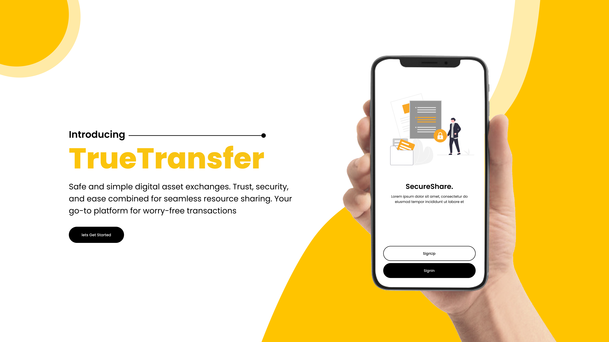
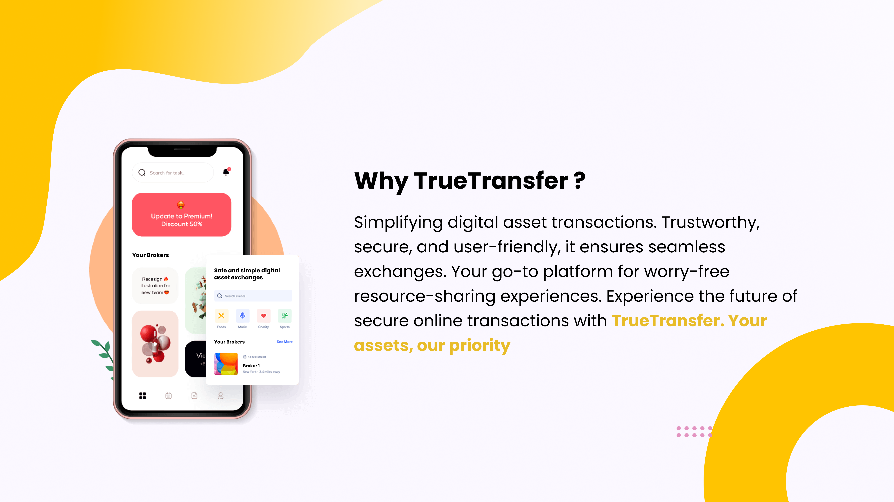

# True Transfer 🥏
### The digital assets sharing app
---

## Introduction
In the dynamic digital landscape, exchanging valuable assets like social media or gaming accounts poses significant risks due to scams and fraud. Traditional peer-to-peer methods lack security measures, creating a need for a solution. Enter the Resource-Sharing Broker, an innovative platform acting as a secure intermediary for transparent and secure digital asset transactions. It incorporates advanced verification, a user-centric reputation system, and blockchain integration for immutable transaction records. Users can create dedicated broker rooms, ensuring controlled and monitored environments for secure transactions. The platform, powered by Flutter, Node.js, and MongoDB, redefines digital transactions with enhanced trust and security, setting a standard for secure online resource sharing.

## Objectives
1. Primary Objectives :
     - Establish a secure and transparent platform for the exchange of digital assets
     - Mitigate the risks associated with scams, fraud, and deceptive practices in online
       transactions
     - Empower users with a reliable virtual intermediary that ensures the authenticity of
       exchanged resources.
2. Secondary Objectives :
     - Enhance user confidence in digital asset transactions
     - Provide a user-friendly interface for seamless engagement with the platform
     - Foster a trustworthy environment that encourages participation in resource-sharing
       transactions.
## Scope 
The scope of the project encompasses the development of a Resource-Sharing Broker platform, targeting users engaged in the exchange of digital assets, with a particular focus on social media accounts. The platform will facilitate secure transactions through the creation of virtual broker rooms, incorporating robust verification mechanisms, reputation systems, and an escrow process. Implementation will utilize cutting-edge technologies, including Flutter for the user interface, Node.js for backend logic, and MongoDB for efficient data storage.

## Existing system
The existing system for digital asset transactions, particularly in the context of resource- sharing such as selling and buying social media accounts, is characterized by an informal and decentralized approach. Individuals engaged in such transactions rely on various com- munication channels, such as WhatsApp, Instagram, or direct phone calls, to initiate, ne- gotiate, and finalize deals. While this approach offers a degree of flexibility, it introduces several challenges and shortcomings that hinder the overall effectiveness and security of the transaction process.

 ## Proposed system
The proposed True Transfer application aims to address the aforementioned challenges by introducing a secure, standardized, and user-friendly platform for digital asset trans- actions. The subsequent sections will delve into the specific features, functionalities, and design principles of the proposed system, highlighting the anticipated benefits for users and administrators alike.

---

